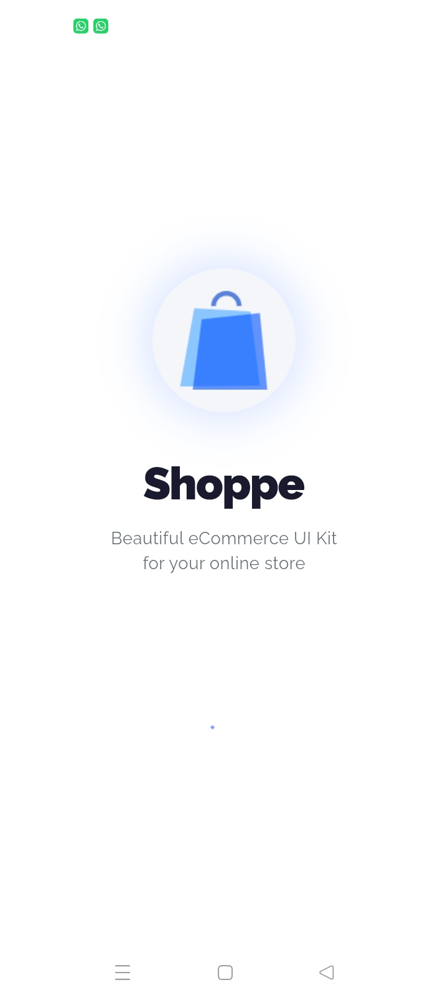
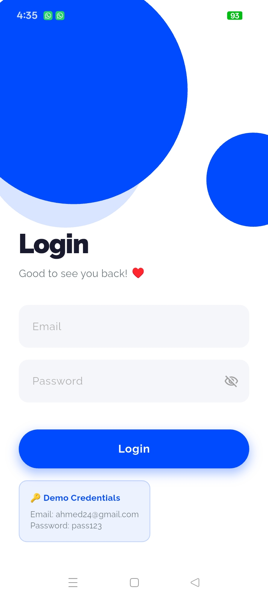
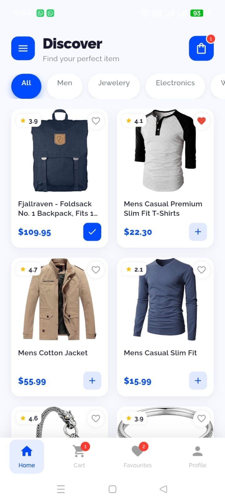
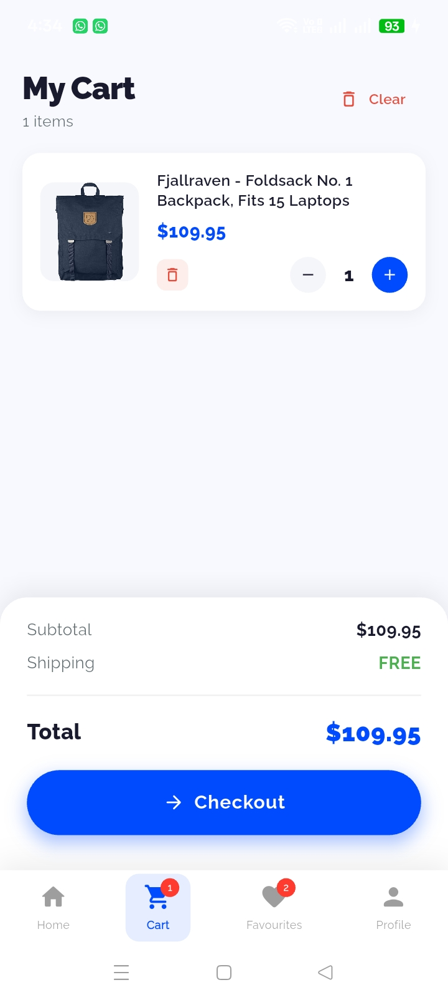
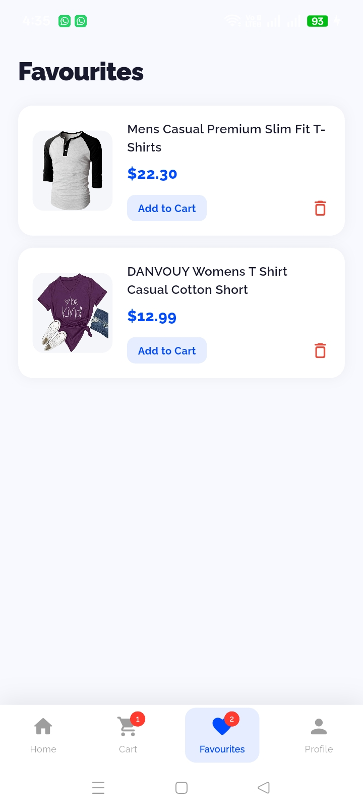
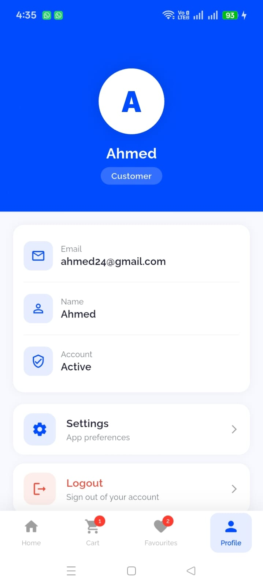
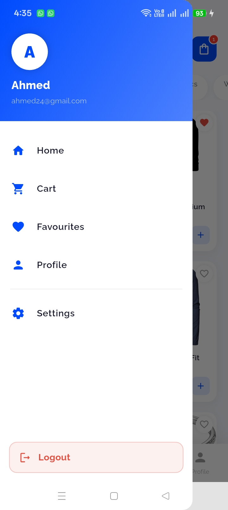
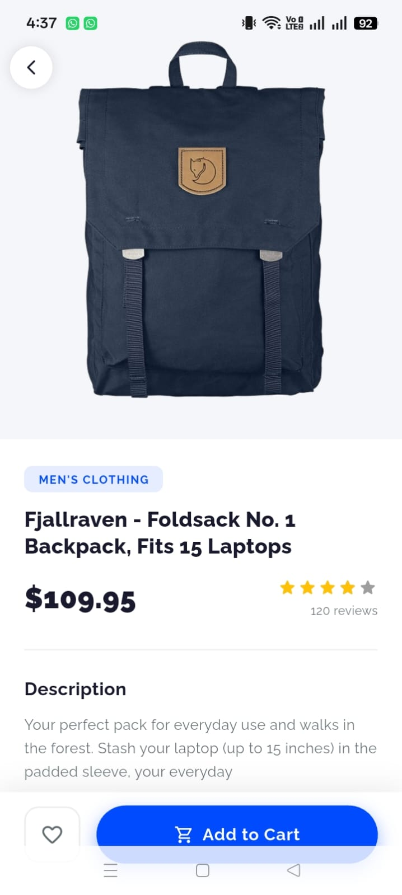
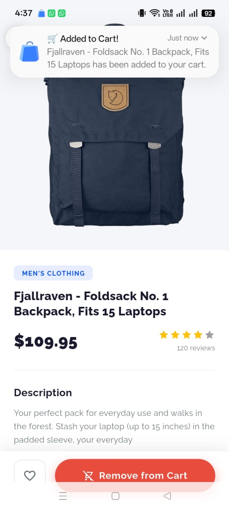

# 🛍️ Shoppe

A clean eCommerce app built with Flutter & GetX.

<table>
  <tr>
    <td align="center"><br/><sub>Splash Screen</sub></td>
    <td align="center"><br/><sub>Login with demo credentials</sub></td>
    <td align="center"><br/><sub>Products with category filter</sub></td>
  </tr>
  <tr>
    <td align="center"><br/><sub>Cart with quantity controls</sub></td>
    <td align="center"><br/><sub>Saved favourites list</sub></td>
    <td align="center"><br/><sub>User profile & settings</sub></td>
  </tr>
  <tr>
    <td align="center"><br/><sub>Side drawer navigation</sub></td>
    <td align="center"><br/><sub>Product detail with add to cart</sub></td>
    <td align="center"><br/><sub>Push notification on cart & favourites</sub></td>
  </tr>
</table>

## Stack
Flutter · GetX · SQLite · Firebase FCM · Dio

## Features
- Login with session persistence
- Product listing with category filter
- Cart & Favourites saved locally (SQLite)
- Push notifications
- Profile Screen
- Logout clears all data & notifications

## Run
```bash
git https://github.com/Syed-Ahmed-Hussain-Bukhari/Shoppe_App.git
cd shoppe
flutter pub get
flutter run
```

**Demo:** `ahmed24@gmail.com` / `pass123`
